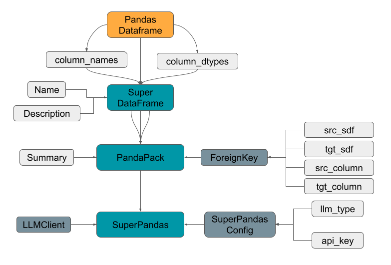

# SuperPandas

## Introduction
SuperPandas is a Python library that extends the functionality of the popular data manipulation library, Pandas. It uses Large (and Small) Language Models to provide a natural language interface to Pandas. This allows users to write code in natural language, which is then converted to Python code that can be executed by Pandas.. The aim is to make data manipulation easier and more accessible to non-technical users. SuperPandas is built on top of Pandas and is designed to be used in conjunction with it. It is not a replacement for Pandas, but rather a complement to it.

Additionally, the project aims to include other data science related libraries such as Scikit-learn, and Matplotlib in the future.

## Installation
To install SuperPandas, you can either use pip:

```pip install superpandas```

or clone the repository and install it manually:

```
    git clone https://github.com/superpandas-dev/superpandas.git
    cd superpandas
    pip install .
```

## Concepts
SuperPandas adds a few new concepts to Pandas DataFrame to make it more amenable for use by LLMs. They are shown in the following diagram:


### SuperDataFrame (SDF):
A SuperDataFrame is a subclass of Pandas' DataFrame ~~(not yet. In works. Presently it's a composition)~~. It is a container for data, and has all the functionality of a Pandas DataFrame, plus some additional attributes and methods that allow it to be used with SuperPandas' natural language interface. The additional attributes are :
-   DataFrame `name` and `description` : They are used in the prompts to LLMClient. They can be manually set by the user or obtained by the LLMClient.
-   DataFrame column names and datatypes : They are also used in the prompts to LLMClient and are extracted from the underlying DataFrame. 

Additionally there is a ForeignKey datastructure that is used to store relationships between SuperDataFrames.

### ForeignKey:
A ForeignKey is a Python dataclass that is used to store relationships between SuperDataFrames. It includes information about source and target SDF and the columns that are used to join them. This informatiom is useful when we have a collection of SDF in the form of a PandaPack.

### PandaPack
A PandaPack is a collection of SuperDataFrames; something like a database in SQL which has multiple tables. It is used to store and manage multiple SuperDataFrames linked together with ForeignKeys, and provides methods for working with them as a group. The additional property of PandasPack is a `summary` attribute that is used to store a summary of the database that constitutes the PandaPack. It is used by the prompt in the LLMClient. This summary can be provided by user or obtained from the LLMClient.

### LLMClient
LLMClient is a class that is used to interface with a Large (or Small) Language Model. It provides a uniform interface to various inference engines. Presently three inference engines are supported: OpenAI's [python API](https://github.com/openai/openai-python), HuggingFace's [TGI engine](https://huggingface.co/docs/text-generation-inference/en/index) and [vLLM](https://github.com/vllm-project/vllm).

### SuperPandasConfig
It is an extensible configuration class that is used to store the configuration of the SuperPandas library. Presently it has configuration for the LLMClient.

### SuperPandas
This is the main class that the user interacts with, to use SuperPandas. It is initialized with a PandaPack and a SuperPandasConfig to setup the LLMClient. It has various methods to query the LLM using the PromptTemplates and to get the results of the queries.

### PromptTemplates

- TBD

## Usage
The project offers both a webapp and a Python API. The webapp can be accessed [here](https://superpandas.streamlit.app/). The Python library can be used as follows:

```python
import superpandas as spd
import pandas as pd

df1=pd.DataFrame({'a': [1, 2, 3], 'b': [4, 5, 6]})
df2=pd.DataFrame({'c': [7, 8, 9], 'd': [10,11,12]})
sdf1 = spd.SuperDataFrame(df1,name='Table1')
sdf2 = spd.SuperDataFrame(df2,name='Table2')
pdp = PandaPack(sdf=[sdf1, sdf2])
pdp.add_foreign_key('Table1', 'b', 'Table2', 'd') # Column b in Table1 is a foreign key to column d in Table2

config = spd.SuperPandasConfig(llm_type='tgi')
spd = SuperPandas(pdp=pdp, config=config)

# Get the description of the table from the LLM
table1_description = spd.get_table_description_from_llm('Table1')

# Get the summary of the table from the LLM
pdp_summary = spd.get_pdp_summary_from_llm()
pdp.set_summary(pdp_summary)

# Query the LLM for average of column 'a' in Table1
result = spd.query_llm('What is the average of column a in Table1?')
```

## Documentation
The documentation for SuperPandas can be found [here](https://superpandas.readthedocs.io/en/latest/).

## Roadmap/TODOs

### Technical
- [ ] Improve Prompt Templates
- [ ] Launch Fine-tuned LLM
- [ ] Streamlit Webapp
- [ ] Add support for more inference engines
- [ ] Add support for Matplotlib
- [ ] Add support for Scikit-learn

### Non-Technical
- [ ] Feedback mechanism

